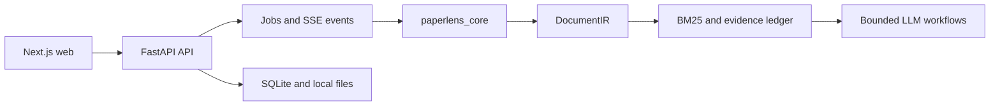

<div align="center">

# PaperLens

**An evidence-grounded workspace for reading and comparing research papers.**

Upload a PDF or import an arXiv paper, then read, translate, ask questions,
inspect citations, and compare papers without losing the path back to the source.

[简体中文](README.zh-CN.md) · [Documentation](docs/README.md) ·
[Contributing](CONTRIBUTING.md) · [Roadmap](docs/roadmap.md)

[](https://github.com/ZilaiWang/paperlens/actions/workflows/ci.yml)
[](CHANGELOG.md)
[](core/pyproject.toml)
[](LICENSE)

</div>

## Product tour


### Read the paper first


The single-paper reader is the product center. It reconstructs the document as
a readable paper, keeps the original PDF one click away, and leaves only the
outline, paper, and one **Ask the paper** entry visible by default. Figures,
tables, references, translation controls, and parse warnings appear only in
their reading context.

### Move from a library into focused work

| Paper library | Translation controls |
| --- | --- |
|  |  |

The library is for opening and selecting papers—not creating a separate project
model. Select two or three papers to enter comparison mode. Terminology and
fixed translations live under reader settings, where they support bilingual
reading without competing with it in the main navigation.

### Compare with evidence, not flattened summaries


Comparison starts from papers you are already reading. Each paper is extracted
independently before PaperLens aligns methods, experiments, metrics, limitations,
and custom dimensions. Incomparable conditions remain visible, and supported
claims retain links back to their paper evidence.

## Why PaperLens?

Academic PDFs are not plain text. Reading order, columns, equations, tables,
citations, and page geometry all matter. Sending an entire PDF directly to a
language model often destroys that structure and makes answers difficult to
verify.

PaperLens first builds a deterministic document representation. Retrieval and
language-model workflows operate on that representation, and evidence links
connect generated claims back to exact blocks, character spans, pages, and PDF
coordinates.

## What it can do

- **Structured import:** upload PDF files or import arXiv papers. Modern arXiv
  pages use structured HTML first; PDF parsing remains the fallback.
- **Canonical-first Parser v2:** probe, plan and fuse structure from optional
  Docling plus local PyMuPDF/pdfplumber backends, score paragraph/order/table/
  formula/reference quality, then selectively repair only weak pages. GROBID
  and PaddleOCR-VL are optional semantic and visual providers.
- **Bilingual reading:** translate incrementally with terminology, citation,
  number, and formula protection.
- **Grounded Q&A:** retrieve paragraph-level evidence with BM25, draft atomic
  claims, run deterministic and model-based attribution checks, then link every
  accepted claim to its source.
- **Adaptive Paper Agent:** route quick questions through the fast reader and
  plan 3–8 evidence, method, experiment, reproduction, or critic capabilities
  for deeper questions. Findings distinguish fact, inference, assessment, and
  unknown states.
- **Cross-paper comparison:** compare two or three paper versions, distinguish
  missing evidence from confirmed absence, and avoid ranking incomparable
  metrics or datasets.
- **Installable terminology:** domain term packs participate in translation
  automatically; personal entries are explicit overrides rather than a
  separate terminology product.
- **Reference workflow:** extract references, lint citation formatting, resolve
  identities through scholarly APIs, and import public arXiv sources.

## Quick start

### Requirements

- Python 3.10 or newer
- [Bun](https://bun.sh/) 1.3 or newer
- An OpenAI-compatible chat-completions endpoint for translation and analysis
  features; parsing and offline tests do not require a model

### Run locally

```bash
git clone https://github.com/ZilaiWang/paperlens.git
cd paperlens

python3 -m venv .venv
.venv/bin/pip install -e "core[server,dev]"
# Optional enhanced geometry/table path; review its AGPL/commercial license.
.venv/bin/pip install -e "core[pymupdf]"
cp .env.example .env
.venv/bin/uvicorn server.app.main:app --reload --port 8700
```

In a second terminal:

```bash
cd web
bun install --frozen-lockfile
NEXT_PUBLIC_API_BASE=http://127.0.0.1:8700 bun run dev
```

Open [http://127.0.0.1:3000](http://127.0.0.1:3000). The API schema is
available at [http://127.0.0.1:8700/docs](http://127.0.0.1:8700/docs).

The default `.env.example` points to a local OpenAI-compatible endpoint. Update
`OPENAI_BASE_URL`, `OPENAI_API_KEY`, and `PAPERLENS_MODEL` for your provider.
See the [configuration reference](docs/configuration.md) for every supported
setting.

## Architecture



The repository is a small polyglot monorepo:

```text
core/       Python domain library: parsing, DocumentIR, retrieval, analysis
server/     FastAPI transport, persistence adapters, jobs, and application services
web/        Next.js reader and comparison interface
scripts/    Reproducible evaluation and release utilities
tests/      Offline regression tests and downloadable corpus manifest
docs/       User, operator, contributor, architecture, and decision documentation
```

Read [Architecture](docs/architecture.md) for data flow, module boundaries, and
the rules intended to keep the project evolvable.

## Development

```bash
.venv/bin/ruff check core server scripts tests
.venv/bin/python -m pytest
cd web && bun run build
```

The evaluation PDFs are intentionally not stored in Git. Download and verify
them from the checked-in manifest when needed:

```bash
.venv/bin/python scripts/fetch_eval_corpus.py
.venv/bin/python scripts/eval_parse.py --corpus tests/eval_corpus
PYTHONPATH=core .venv/bin/python scripts/agent_bench.py
```

See [Development](docs/development.md), [Testing](docs/testing.md), and
[Contributing](CONTRIBUTING.md) before opening a pull request.

## Project status and limitations

PaperLens 1.3 is usable as a self-hosted, single-process application. Anonymous
workspaces use an opaque HttpOnly session cookie and storage-level scoping, and
development CORS is restricted to the configured frontend origins. This is
identity isolation, not user-account authentication: it is not yet a
multi-tenant cloud service. SQLite and in-process jobs remain deliberate
constraints. Do not expose the API directly to the public internet without an
authentication layer, TLS, and a restrictive reverse proxy.

Complex borderless tables, scanned PDFs, formula OCR, and unusual multi-column
layouts can still produce partial parses. PaperLens reports parse and evidence
gaps rather than treating missing extraction as proof that a paper omitted
something.

See [Roadmap](docs/roadmap.md) for the planned modularization and scaling path.

## Community and security

- Use [GitHub Issues](https://github.com/ZilaiWang/paperlens/issues) for bugs and
  feature proposals.
- Read [SECURITY.md](SECURITY.md) before reporting a vulnerability.
- Participation is governed by [CODE_OF_CONDUCT.md](CODE_OF_CONDUCT.md).

## License

PaperLens is released under the [MIT License](LICENSE). Papers imported by users
remain subject to their original licenses and terms; PaperLens does not grant
redistribution rights for third-party documents. Optional PyMuPDF support is
dual-licensed under AGPL/commercial terms; review
[third-party notices](THIRD_PARTY_NOTICES.md) before distribution or hosted use.
