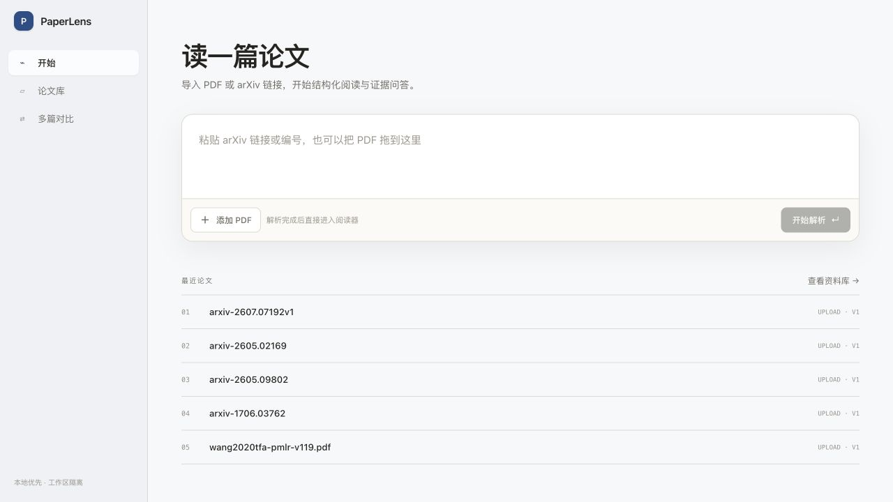
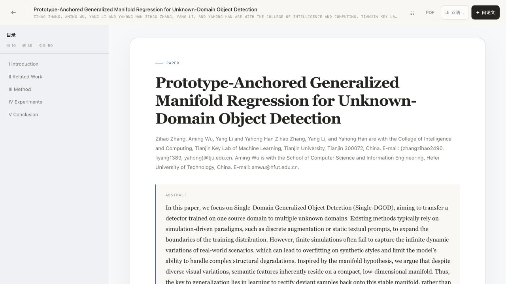
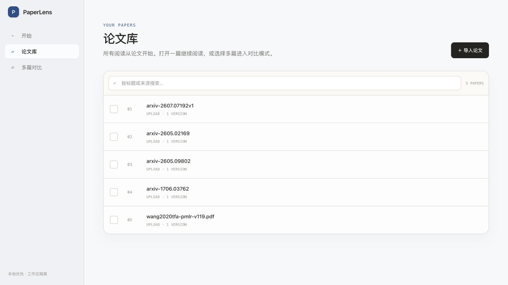
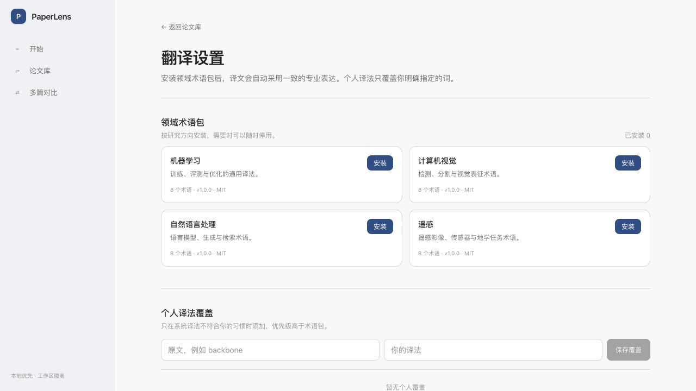
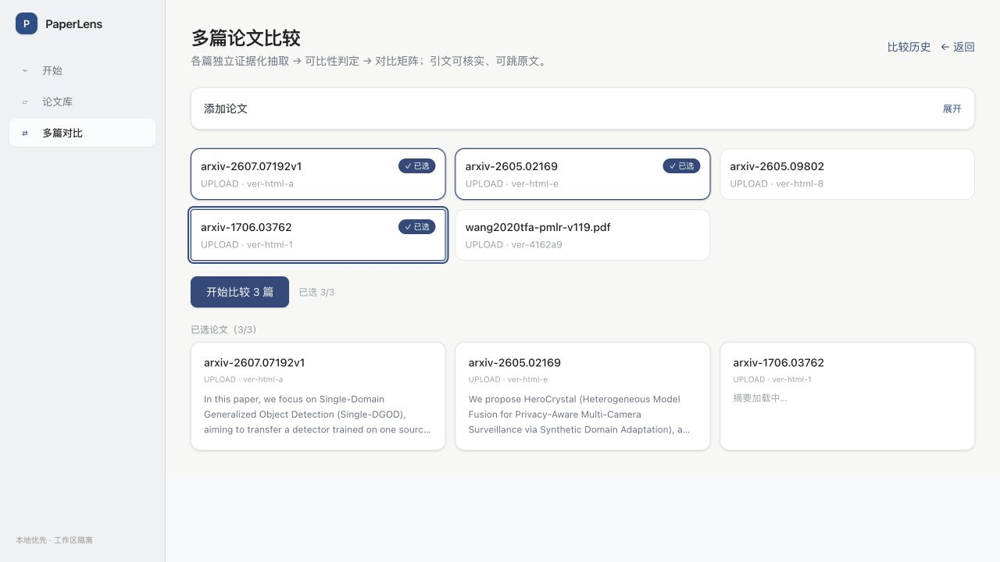
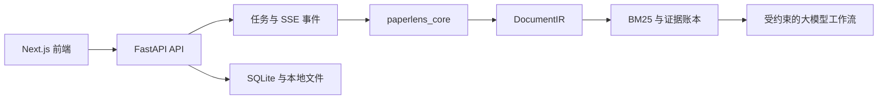

<div align="center">

# PaperLens

**证据可追溯的学术论文阅读与对比工作台。**

上传 PDF 或导入 arXiv 论文，在不丢失原文定位的前提下完成阅读、翻译、
问答、引用核验和多篇比较。

[English](README.md) · [文档](docs/README.md) ·
[参与贡献](CONTRIBUTING.md) · [路线图](docs/roadmap.md)

[](https://github.com/ZilaiWang/paperlens/actions/workflows/ci.yml)
[](CHANGELOG.md)
[](core/pyproject.toml)
[](LICENSE)

</div>

## 产品导览



### 先把一篇论文读懂



单篇阅读器是 PaperLens 的产品中心。正文以可读的论文版式重建，同时保留一键
返回原版 PDF；目录、图表、引用、论文洞察、翻译和证据问答都围绕当前阅读上下文
展开。右侧“问论文”默认关闭，首先把屏幕空间完整交给论文。

### 从论文库进入具体工作

| 论文库 | 阅读与翻译设置 |
| --- | --- |
|  |  |

论文库负责打开和选择论文，不要求用户先理解另一套“研究项目”模型。选择两到三篇
论文即可进入对比模式。术语和固定译法位于阅读器设置中，作为双语阅读的内部能力，
不再占据一级导航。

### 基于证据进行多篇比较



多篇比较从正在阅读的论文自然发起。系统先独立抽取每篇论文，再对齐方法、实验、
指标、局限和自定义维度；不可比条件会被明确保留，有证据的结论可以继续跳回原文。

## 为什么做 PaperLens？

学术 PDF 不是普通纯文本。阅读顺序、双栏、公式、表格、引用和页面几何位置
都会影响理解。把整份 PDF 直接交给大模型，往往会破坏这些结构，也很难验证
回答依据。

PaperLens 先用确定性解析构建文档表示，再让检索和大模型工作流基于该表示运行。
每条通过核验的主张都能通过证据链接返回具体 block、字符区间、页码和 PDF 坐标。

## 核心能力

- **结构化导入：**支持上传 PDF 和导入 arXiv；较新的 arXiv 论文优先解析
  结构化 HTML，无法获取时回退 PDF。
- **Canonical-first Parser v2：**先探测文档，再由可选 Docling 与本地
  PyMuPDF/pdfplumber 后端规划、融合结构；分别评估段落、顺序、表格、公式和
  引用品质，只对弱页定向修复。GROBID 与 PaddleOCR-VL 是可选语义/视觉后端。
- **双语阅读：**渐进式翻译，并保护术语、引用、数字和公式。
- **证据问答：**BM25 段落检索、原子主张生成、确定性守卫与语义归因核验，
  最终回答可跳回原文。
- **自适应 Paper Agent：**快速问题直接进入阅读问答；复杂问题自动规划 3–8 个
  证据、方法、实验、复现或批判性检查任务，并区分事实、推断、判断和未知状态。
- **多篇比较：**比较 2–3 个论文版本，区分“没有检索到”和“确认未报告”，
  不对数据集或指标条件不同的结果做不可靠排名。
- **可安装术语包：**领域术语包自动参与翻译，个人译法只作为明确覆盖项；术语能力
  留在翻译设置中，不再成为与单篇、多篇并列的产品入口。
- **参考文献链路：**抽取参考文献、检查格式、通过学术元数据服务核验身份，
  并可导入公开的 arXiv 来源。

## 快速开始

### 环境要求

- Python 3.10 或更高版本
- [Bun](https://bun.sh/) 1.3 或更高版本
- 翻译和分析功能需要 OpenAI 兼容的对话模型接口；解析和离线测试不需要模型

### 本地运行

```bash
git clone https://github.com/ZilaiWang/paperlens.git
cd paperlens

python3 -m venv .venv
.venv/bin/pip install -e "core[server,dev]"
# 可选的增强几何/表格路径；安装前请确认其 AGPL/商业许可要求。
.venv/bin/pip install -e "core[pymupdf]"
cp .env.example .env
.venv/bin/uvicorn server.app.main:app --reload --port 8700
```

打开第二个终端：

```bash
cd web
bun install --frozen-lockfile
NEXT_PUBLIC_API_BASE=http://127.0.0.1:8700 bun run dev
```

访问 [http://127.0.0.1:3000](http://127.0.0.1:3000)。API 文档位于
[http://127.0.0.1:8700/docs](http://127.0.0.1:8700/docs)。

`.env.example` 默认指向本地 OpenAI 兼容接口。使用其他服务时，请修改
`OPENAI_BASE_URL`、`OPENAI_API_KEY` 和 `PAPERLENS_MODEL`。所有配置项见
[配置参考](docs/configuration.md)。

## 架构概览



仓库采用小型多语言 monorepo：

```text
core/       Python 领域库：解析、DocumentIR、检索与分析
server/     FastAPI 传输层、持久化适配、任务与应用服务
web/        Next.js 阅读与比较界面
scripts/    可复现评测和发布工具
tests/      离线回归测试与可下载评测语料 manifest
docs/       用户、运维、开发、架构和设计决策文档
```

完整数据流、模块边界和演进约束见[架构文档](docs/architecture.md)。

## 开发与验证

```bash
.venv/bin/ruff check core server scripts tests
.venv/bin/python -m pytest
cd web && bun run build
```

评测 PDF 不进入 Git。需要时根据仓库中的 manifest 下载并校验：

```bash
.venv/bin/python scripts/fetch_eval_corpus.py
.venv/bin/python scripts/eval_parse.py --corpus tests/eval_corpus
PYTHONPATH=core .venv/bin/python scripts/agent_bench.py
```

提交改动前请阅读[开发指南](docs/development.md)、[测试指南](docs/testing.md)
和[贡献指南](CONTRIBUTING.md)。

## 项目状态与边界

PaperLens 1.3 适合作为自托管、单进程应用使用。匿名工作区使用不透明的
HttpOnly 会话 Cookie 与存储层 workspace 隔离，开发环境 CORS 也只允许显式配置
的前端来源。这属于身份隔离，并不等同于用户账号认证；项目目前仍不是多租户云
服务。SQLite 与进程内任务仍是明确边界。未增加账号认证、TLS 和严格反向代理
配置前，不要把 API 直接暴露到公网。

复杂无边框表格、扫描 PDF、公式 OCR 和特殊多栏版面仍可能导致部分解析失败。
PaperLens 会暴露解析缺口和证据缺口，而不会把“未提取到”误判为“论文未报告”。

后续模块化和扩展计划见[路线图](docs/roadmap.md)。

## 社区与安全

- Bug 和功能建议请提交到 [GitHub Issues](https://github.com/ZilaiWang/paperlens/issues)。
- 安全问题请先阅读 [SECURITY.md](SECURITY.md)。
- 社区参与遵循 [CODE_OF_CONDUCT.md](CODE_OF_CONDUCT.md)。

## 许可证

PaperLens 使用 [MIT License](LICENSE)。用户导入的论文仍受原始许可证和使用条款
约束；PaperLens 不授予任何第三方文档的再分发权。可选的 PyMuPDF 支持采用
AGPL/商业双重许可，分发或提供网络服务前请阅读
[第三方依赖说明](THIRD_PARTY_NOTICES.md)。
