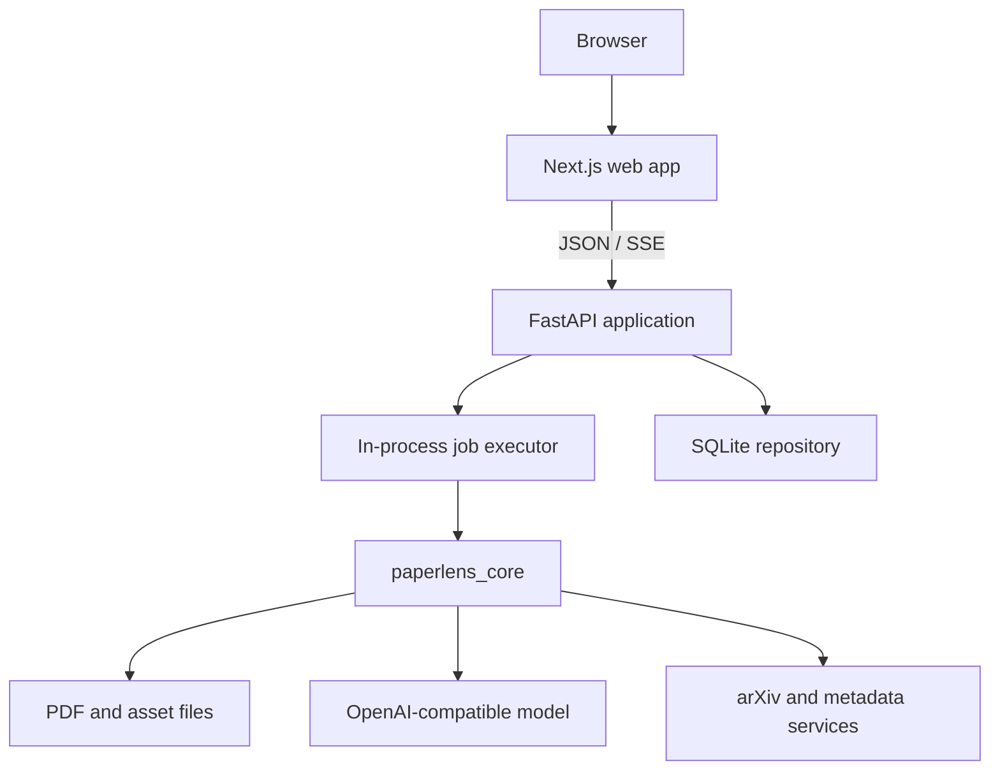

# Architecture

PaperLens is a document-understanding application with bounded language-model
workflows. Its central rule is simple:

> Restore and persist document structure first. Retrieve evidence second. Use a
> model only inside explicit evidence and schema boundaries.

This rule keeps parsing reproducible, makes answers inspectable, and prevents
the web interface or model provider from becoming the source of truth.

## System context



The 1.0 deployment model is one API process, one web process, SQLite, and local
files. This is appropriate for personal and small-team self-hosting. It is not a
multi-tenant distributed architecture.

## Core data flow

```mermaid
flowchart LR
    Source["PDF or arXiv"] --> Probe["Document probe"]
    Probe --> Plan["Capability plan"]
    Plan --> Candidates["Backend candidates"]
    Candidates --> Fusion["Canonicalize and region fusion"]
    Fusion --> Quality["Object and page quality"]
    Quality -->|"weak regions only"| Repair["Selective repair"]
    Repair --> Fusion
    Quality --> Blocks["CanonicalDocument + compatibility blocks"]
    Blocks --> Sections["Paragraphs and sections"]
    Sections --> Assets["Figures, tables, formulas, references"]
    Sections --> Chunks["Retrieval chunks"]
    Chunks --> BM25["BM25 index"]
    BM25 --> Ledger["Evidence ledger"]
    Ledger --> Workflows["Q&A, profile, quality, comparison"]
    Workflows --> Claims["Validated claims and locators"]
```



### Import and parsing

Uploaded PDFs enter `ParsePipeline` v2 through `ProductionParseService`.
`DocumentProbe` measures text coverage, scan likelihood, columns, tables, and
formulas before `ParsePlanner` selects available capabilities. Docling is the
optional preferred structure source; PyMuPDF and pdfplumber are deterministic
local sources; GROBID contributes academic semantics; PaddleOCR-VL is excluded
from full-document parsing and invoked only for pages selected for repair.

The pipeline runs primary fusion, object/page quality, targeted reparse, region
fusion, and final quality. A second repair pass is allowed only within the page
budget. Provider failures and repair decisions are persisted in `ParseRun`.
For supported arXiv papers, LaTeXML HTML remains the source-first path.

Parsing first produces stable `CanonicalNode` revisions with provenance.
`blocks_from_canonical_document` is an explicit compatibility projection for
the reader, section detector, and chunker; legacy blocks are no longer the PDF
pipeline's source of truth.

### DocumentIR and identity

`core/paperlens_core/documents.py` defines persisted document entities:

- `Paper` and `PaperVersion` separate a logical paper from one imported version;
- `Block`, `Section`, and `Page` describe the reading representation;
- `Asset`, `Reference`, and `CitationCallout` describe linked resources;
- `Chunk` and `ChunkSegment` are retrieval derivatives, not display truth;
- `TranslationUnit`, `Annotation`, and `AgentRun` describe derived work.

Comparisons use `paper_version_id`, not logical `paper_id`, because evidence and
extraction belong to a specific version. Stable block IDs incorporate version
content, page, geometry, and text hashes.

### Retrieval and evidence

Chunks retain segment-to-block mappings. `BM25Index` performs deterministic
lexical retrieval. `build_evidence_ledger` turns hits into bounded evidence
items with excerpts and locators. Model outputs may cite only IDs from that
request's ledger.

`EvidenceGuard` checks citation ownership, verbatim support, numbers, negation,
and comparison language before claims are accepted. Selected workflows add a
separate semantic attribution pass. Missing retrieval is represented explicitly
and never upgraded to “the paper did not report this” without stronger evidence.

### Language-model boundary

`StructuredModel` is the narrow core protocol. Production uses an
OpenAI-compatible adapter; tests use deterministic responses. Workflows pass a
system prompt, bounded evidence package, Pydantic schema, stage name, and thread
identifier. Validation failures can take one schema-repair path.

PaperLens does not expose an unrestricted tool-calling agent. `DepthRouter`
keeps localized facts on the quick reader path and creates bounded 3–8 task
plans for analytic/deep questions. The allow-listed registry covers evidence,
document, method, experiment, reproduction, critical review, and literature
capabilities. Findings separate fact, inference, assessment, and unknown states
and carry evidence IDs, confidence, and caveats.

## Server layers

```text
server/app/main.py                  FastAPI composition and legacy v1 routes
server/app/routers/                 Versioned feature transport
server/app/schemas.py               Public request contracts
server/app/services/                Application orchestration adapters
server/app/repositories/            Workspace-scoped vNext persistence
server/app/auth/                    Anonymous session resolution and cookies
server/app/jobs.py                  Import and translation job workflows
server/app/repository.py            SQLite persistence adapter
server/app/events.py                In-process SSE event bus
server/app/arxiv.py                 arXiv metadata and PDF transport
server/app/logging_config.py        Logging setup
```

The v2 surface is mounted from feature routers and delegates reusable work to
services and repositories. `main.py` still contains the legacy v1 surface; new
domain logic must not be added there. Continue extracting coherent v1 features
incrementally while preserving URLs and OpenAPI contracts.

## Frontend layers

The Next.js product hierarchy is import → paper reader → Paper Agent, with the
library and comparison as auxiliary surfaces. Terminology is translation
infrastructure, not primary navigation. `web/lib/api.ts` owns legacy paper
transport and `web/lib/apiV2.ts` owns workspace-scoped contracts.
Components render persisted document and evidence data; they do not decide
whether a claim is supported.

`Workbench.tsx`, `AgentPanel.tsx`, and the comparison page are current
modularization hotspots. Split them by feature state and view responsibility,
not into generic “utils” files.

## Persistence

The server stores small structured collections as JSON payloads keyed by paper
version and kind, alongside normalized operational tables for papers, jobs,
sessions, messages, annotations, and comparisons. This keeps 1.0 migration
logic small but limits queryability and concurrent scaling.

SQLite is configured for WAL mode. The job executor and event bus live in
process memory, so multiple API workers would not share live progress or SSE
events. A future distributed deployment must move jobs and events to durable
infrastructure before adding workers.

Anonymous workspace identity is represented by an opaque, hashed session token
sent only in an HttpOnly cookie. The server never trusts a client-selected
workspace ID. This prevents accidental cross-workspace access but is not a
replacement for account authentication in a public deployment.

## Dependency rules

1. `core` must not import `server` or `web`.
2. Server schemas may use Pydantic and core public types, but core workflows may
   not know about FastAPI.
3. The frontend consumes HTTP contracts and never reads the SQLite database.
4. Scripts may call public core APIs; product code may not import scripts.
5. Parsing, retrieval, and evidence validation must remain runnable without a
   configured model.
6. External provider details stay behind adapters.
7. Persisted evidence identity changes require migration and regression tests.

## Extension points

- Add a PDF backend through `ParserBackend`; candidates must pass canonical
  fusion and object-quality contracts.
- Add a model provider through the OpenAI-compatible adapter or a new
  `StructuredModel` implementation.
- Add an analysis workflow as a typed core function returning evidence-bound
  Pydantic models.
- Add a deployment adapter without changing domain models.

Avoid plugin systems until at least two independently maintained extensions
need the same boundary. A premature plugin runtime would add versioning,
permissions, discovery, and security obligations without solving the current
scaling bottlenecks.
